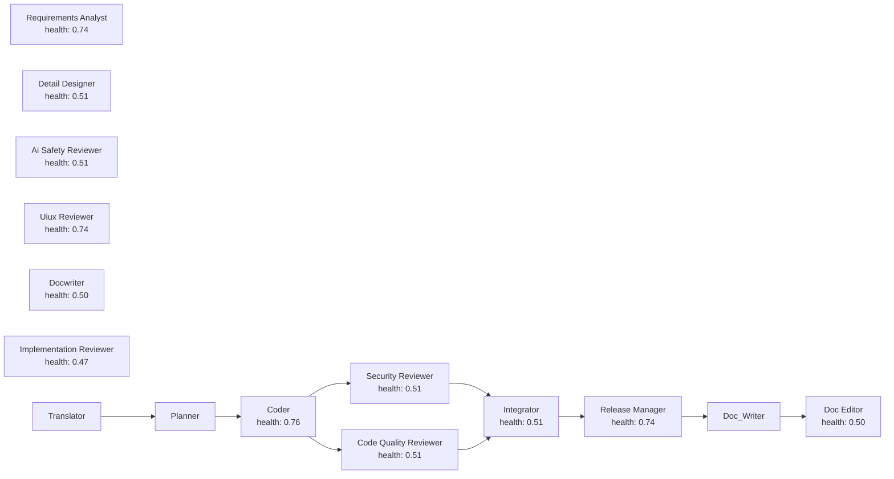

# Workflow Graph (candidate)

```mermaid
flowchart LR
  Requirements_Analyst["Requirements Analyst\nhealth: 0.74"]
  Detail_Designer["Detail Designer\nhealth: 0.51"]
  Coder["Coder\nhealth: 0.76"]
  Code_Quality_Reviewer["Code Quality Reviewer\nhealth: 0.51"]
  Security_Reviewer["Security Reviewer\nhealth: 0.51"]
  Ai_Safety_Reviewer["Ai Safety Reviewer\nhealth: 0.51"]
  Uiux_Reviewer["Uiux Reviewer\nhealth: 0.74"]
  Docwriter["Docwriter\nhealth: 0.50"]
  Doc_Editor["Doc Editor\nhealth: 0.50"]
  Integrator["Integrator\nhealth: 0.51"]
  Release_Manager["Release Manager\nhealth: 0.74"]
  Implementation_Reviewer["Implementation Reviewer\nhealth: 0.47"]
  Translator --> Planner
  Planner --> Coder
  Coder --> Code_Quality_Reviewer
  Coder --> Security_Reviewer
  Security_Reviewer --> Integrator
  Code_Quality_Reviewer --> Integrator
  Integrator --> Release_Manager
  Release_Manager --> Doc_Writer
  Doc_Writer --> Doc_Editor
```
