Plan Summary
- Create a single documentation file with a Mermaid “Immunity Map” template that renders in Mermaid Live Editor and omits empty nodes/edges by default.
- Keep scope to one new doc, no other file changes.
- Provide clear usage notes so contributors only add nodes/edges with content.

Proposed Minimal Change
- New file: docs/analysis/immune-map.md
- Contents:
  - Short intro explaining Immunity Map vs. 5 Whys (no migration of old docs).
  - Ready-to-render Mermaid snippet with three levels (A–F categories), using subgraphs.
  - Example nodes and edges are commented out; users only uncomment/populate items that have content, which naturally hides empty elements.

Exact Mermaid Snippet (to implement)

```mermaid
flowchart TD
  %% Immunity Map Template (A–F)
  %% Direction: top-down (TD). Switch to LR if preferred (flowchart LR).

  %% Level 1 (A): Things to do / Can't do / Want to do
  subgraph A["Level 1 – Actions & Constraints (Do / Can't / Want)"]
    %% Uncomment and edit actual items:
    %% A1["Do: <text>"]
    %% A2["Can't: <text>"]
    %% A3["Want: <text>"]
  end

  %% Level 2 (B, C)
  subgraph B["Level 2 – Inhibitors"]
    %% B1["<inhibitor>"]
    %% B2["<inhibitor>"]
  end

  subgraph C["Level 2 – Shadow Goals / Ideals / Goals"]
    %% C1["<shadow goal / ideal>"]
    %% C2["<goal>"]
  end

  %% Level 3 (D, E, F)
  subgraph D["Level 3 – Deep Psychology / Bias (causing B)"]
    %% D1["<deep cause / bias>"]
  end

  subgraph E["Level 3 – True Needs (from B & C)"]
    %% E1["<true need>"]
  end

  subgraph F["Level 3 – Fundamental Fixed Concepts (from C)"]
    %% F1["<fixed concept>"]
  end

  %% Edges (add only when both referenced nodes exist):
  %% A1 --> B1
  %% A1 --> C1
  %% A2 --> B2
  %% A3 --> C2
  %% B1 --> D1
  %% B1 --> E1
  %% C1 --> E1
  %% C1 --> F1
```


Why this fits constraints
- Single-file, documentation-only change; no code or build impact.
- Renders in Mermaid Live Editor immediately.
- Hides empty nodes/edges because nothing is uncommented by default.
- Clear mapping of edges as required: A→B, A→C, B→D, B→E, C→E, C→F.

Open Questions
- Keep letters A–F visible in subgraph titles? (Current template shows them in subgraph names only.)
- Preferred direction: TD (current) vs LR.
- Do you want a link added in docs/INDEX.md for discoverability? (Would add one more small change.)
- Should we deprecate mentions of “Why-Why analysis” in docs/features/analytics-insights/requirements.md now, or in a later pass?

Risks
- Empty subgraphs still display their labeled headers; requirement focuses on nodes/edges, which this template hides by default. If full invisibility of empty groups is required, we’d need conditional generation (out of scope for Mermaid alone).
- Existing references to 5 Whys remain; not changing them keeps scope minimal but may cause inconsistency until follow-up.

Validation
- Paste the snippet into Mermaid Live Editor; confirm it renders.
- Uncomment a minimal pair like A1, B1, C1 and corresponding edges; confirm layout and connections render as expected.
- Confirm that leaving any item commented omits its node/edge.

```json
{"steps":["coder"],"notes":"One-file documentation update: add docs/analysis/immune-map.md with a ready-to-render Mermaid Immunity Map template. No other files changed to minimize scope. Template uses commented example nodes/edges so only contentful items are shown, satisfying the hide-empty requirement.","tests":"Manual: 1) Open Mermaid Live Editor and paste the snippet; verify it renders with empty groups only. 2) Uncomment A1, B1, C1, D1, E1, F1 progressively and add edges A1->B1, A1->C1, B1->D1, B1->E1, C1->E1, C1->F1; verify edges render correctly. 3) Re-comment nodes/edges to confirm they disappear without errors."}
```