# Immunity Map (Mermaid Template)

This replaces "5 Whys" with an Immunity Map structure for retrospectives. Paste the Mermaid snippet below into Mermaid Live Editor to render and tailor it. Only add nodes and edges that have content; leaving examples commented keeps empty items hidden.

## Usage

- Open Mermaid Live Editor and paste the snippet.
- Duplicate/uncomment example nodes (A1, B1, …) and rename labels with actual content.
- Add edges only between existing nodes to reflect: A→B, A→C, B→D, B→E, C→E, C→F.
- Keep unused nodes/edges commented so they do not render.

> Note: Empty subgraphs still show their titles in Mermaid. Nodes/edges remain hidden if left commented.

```mermaid
flowchart TD
  %% Immunity Map Template (A–F)
  %% Direction: top-down (TD). Switch to LR if preferred (flowchart LR).

  %% Level 1 (A): Things to do / Can't do / Want to do
  subgraph A["Level 1 – Actions & Constraints (Do / Can't / Want)"]
    %% Uncomment and edit actual items:
    %% A1["Do: <text>"]
    %% A2["Can't: <text>"]
    %% A3["Want: <text>"]
  end

  %% Level 2 (B, C)
  subgraph B["Level 2 – Inhibitors"]
    %% B1["<inhibitor>"]
    %% B2["<inhibitor>"]
  end

  subgraph C["Level 2 – Shadow Goals / Ideals / Goals"]
    %% C1["<shadow goal / ideal>"]
    %% C2["<goal>"]
  end

  %% Level 3 (D, E, F)
  subgraph D["Level 3 – Deep Psychology / Bias (causing B)"]
    %% D1["<deep cause / bias>"]
  end

  subgraph E["Level 3 – True Needs (from B & C)"]
    %% E1["<true need>"]
  end

  subgraph F["Level 3 – Fundamental Fixed Concepts (from C)"]
    %% F1["<fixed concept>"]
  end

  %% Edges (add only when both referenced nodes exist):
  %% A1 --> B1
  %% A1 --> C1
  %% A2 --> B2
  %% A3 --> C2
  %% B1 --> D1
  %% B1 --> E1
  %% C1 --> E1
  %% C1 --> F1
```

## Mapping

- Level 1 (A): Things to do / Can't do / Want to do
- Level 2 (B): Inhibitors; (C): Shadow goals / ideal self / goals
- Level 3 (D): Deep psychology/bias (from B); (E): True needs (from B & C); (F): Fundamental fixed concepts (from C)

## Tips

- Prefer concise, specific labels for each node.
- If you want a left-to-right layout, change the first line to `flowchart LR`.
- Keep letters A–F as structural hints in subgraph titles; omit from node labels if you prefer cleaner output.
