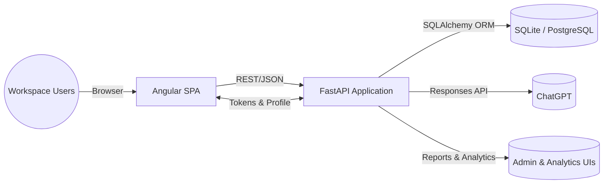

# Architecture Overview

## System Context
Verbalize Yourself consists of an Angular single-page application that talks to a FastAPI backend over JSON APIs. The backend exposes modular routers for cards, analytics, initiatives, competencies, reporting, and administration, all sharing a common SQLAlchemy model layer. AI support is delivered through a dedicated ChatGPT client that structures proposals for on-demand analysis and scheduled report workflows.

## High-level Interaction Diagram

## Component Responsibilities
### Frontend (Angular SPA)
The Angular client lazy-loads feature areas—analysis intake, the kanban board, analytics dashboards, status reports, profile evaluations, workspace settings, and admin tooling—behind authentication guards so only signed-in users can reach workspace experiences and administrators can enter protected areas. Feature modules coordinate the complex workflows: the analyzer submits notes for AI review and filters the resulting proposals, the board renders grouped cards with drag-and-drop interactions, and the status report page captures shift notes before sending them for AI processing. Card detail drawers embed inline comment editors, activity listings, and template visibility hints backed by the workspace signal store, while the profile evaluations page summarizes AI-authored feedback and quota usage for each member.

### Backend (FastAPI Services)
FastAPI mounts routers for analysis, cards, analytics, status reports, initiatives, saved filters, competency management, user preferences, admin controls, and more, giving the client a broad REST surface area with consistent authentication requirements. Status report endpoints orchestrate CRUD operations and status transitions while invoking AI analysis, and analytics endpoints manage snapshots, root-cause investigations, and suggested actions for administrators. Collaboration-focused routers record comments and timeline events for each card, and profile endpoints normalize avatars, biographies, and self-evaluation runs governed by daily quotas.

### AI & Automation Services
`ChatGPTClient` enforces a strict JSON schema when calling OpenAI's Responses API so proposals arrive with titles, summaries, priorities, labels, subtasks, and due-date guidance, while also validating configuration and error paths. Status report processing wraps the client to compose prompts from shift sections, persist status events, and capture returned proposals for potential card creation. Appeal generation reuses the same client and templated prompts stored under `backend/app/prompts` to produce consistent narratives.

### Persistence & Domain Model
A comprehensive SQLAlchemy model layer captures cards, subtasks, labels, statuses, initiatives, analytics artefacts, suggested actions, status reports, quota tracking, competency evaluations, saved filters, appeal requests, and encrypted API credentials. Relationships keep board data, analytics insights, and governance settings synchronized so the frontend can render cohesive dashboards without duplicating business logic.

## Platform Services
### Authentication & Session Management
The backend issues hashed, expiring session tokens and verifies them on each request. On the frontend, the auth service persists tokens, restores sessions, and gates route access through guards for regular users and administrators. Password hashing and token verification live in `backend/app/auth.py`, while guards protect Angular routes declared in `app.routes.ts`.

### Startup Migrations & Schema Maintenance
`app.main` executes lightweight startup migrations before instantiating the FastAPI app. The migrations module ensures core columns exist (such as `users.is_admin`, profile metadata, completion timestamps, and comment-subtask links), renames legacy daily-report tables, and drops deprecated columns. This guarantees SQLite and PostgreSQL schemas stay aligned even when an external migration tool is not available.

### AI-assisted Analysis Intake
Submitting notes from the analyzer invokes the `/analysis` endpoint, which enriches the request with the current user's profile before delegating to the ChatGPT client to generate structured proposals. The frontend filters and publishes the approved items into the workspace store.

### Collaboration & Activity Timeline
Card owners post inline comments through the board drawer, where the workspace signal store appends sanitized entries and lets teammates prune outdated notes; each mutation records an accompanying activity log entry via the `/comments` and `/activity` APIs so the backend preserves an auditable history of changes.

### Status Reporting & Auto Ticketing
Users compile shift sections on the status reports page, create drafts via the API, and optionally submit them for immediate AI processing. The backend validates quotas, records events, requests ChatGPT proposals, and links generated cards back to each report for review and follow-up.

### Analytics & Continuous Improvement
Administrators generate analytics snapshots, run root-cause analyses that create tree-structured investigations, and capture suggested actions that can spawn cards or initiatives, all persisted in relational tables for cross-linking and historical dashboards. The frontend exposes analytics and evaluation pages through dedicated routes to surface these insights alongside the task board.

### Admin & Governance Controls
Admin endpoints manage encrypted external API credentials, workspace quotas, error categories, and competency frameworks, enabling teams to tune automation, enforce limits, and curate evaluation rubrics from a single control plane. A secrets utility wraps AES encryption so stored API keys remain opaque even if the database is compromised.

### Competency Evaluations & Profile Management
Members trigger self-evaluations from the profile page, which tracks quota eligibility, displays the latest competency feedback, and lists historical results. The backend enqueues evaluation jobs, enforces daily limits, and builds enriched profile responses complete with sanitized avatars and roles.

## Additional Resources
- `docs/features/**/requirements.md` – feature requirements documents that define user stories and acceptance criteria.
- `docs/features/**/detail-design.md` – detail designs covering state diagrams, API payloads, and UI wiring.
- `docs/persistence-detail-design.md` – reference for the data model and migration strategy.
- `docs/development-rules.md` – workflow and quality guardrails for contributors.
