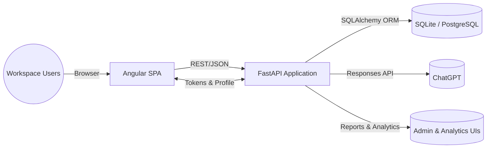

# Architecture Overview

## System Context
Verbalize Yourself is an AI-guided reflection workspace (AIガイドのリフレクションワークスペース) that combines an Angular single-page application with a FastAPI backend that exposes
modular routers for cards, analytics, initiatives, competencies, reporting, and administration while
sharing a common SQLAlchemy model layer.【F:frontend/package.json†L1-L60】【F:frontend/src/app/app.routes.ts†L9-L66】【F:backend/app/main.py†L1-L69】【F:backend/app/models.py†L120-L439】
AI assistance is woven into the platform through a dedicated ChatGPT client that structures proposals
for both ad-hoc analysis and scheduled report generation flows.【F:backend/app/services/chatgpt.py†L43-L190】【F:backend/app/services/daily_reports.py†L23-L199】

## High-level Interaction Diagram

## Component Responsibilities
### Frontend (Angular SPA)
The Angular client lazy-loads feature areas—analysis intake, kanban board, analytics dashboards,
daily reports, profile evaluations, settings, and admin tooling—behind authentication guards so only
signed-in users reach workspace experiences and administrators access protected areas.【F:frontend/src/app/app.routes.ts†L9-L66】【F:frontend/src/app/core/auth/auth.guard.ts†L1-L21】【F:frontend/src/app/core/auth/admin.guard.ts†L1-L23】
Feature modules coordinate complex UI workflows: the analyzer submits notes for AI review and filters
the resulting proposals, the board renders grouped cards with drag-and-drop interactions, and the
daily report page captures shift notes then immediately submits them for AI processing.【F:frontend/src/app/features/analyze/page.ts†L1-L76】【F:frontend/src/app/features/board/page.ts†L1-L199】【F:frontend/src/app/features/reports/reports-page.component.ts†L1-L157】

### Backend (FastAPI Services)
FastAPI mounts routers for analysis, cards, analytics, daily reports, initiatives, saved filters,
competency management, user preferences, admin controls, and more, giving the client a broad REST
surface area with consistent authentication requirements.【F:backend/app/main.py†L1-L69】 Daily report
endpoints orchestrate CRUD operations and status transitions while invoking AI analysis, and analytics
endpoints manage snapshots, root-cause investigations, and suggested actions for admins.【F:backend/app/routers/daily_reports.py†L1-L117】【F:backend/app/routers/analytics.py†L1-L200】 Competency routers let
administrators curate rubrics and trigger evaluations tied to quotas.【F:backend/app/routers/competencies.py†L1-L120】

### AI & Automation Services
`ChatGPTClient` enforces a strict JSON schema when calling OpenAI's Responses API so proposals arrive
with titles, summaries, priorities, labels, subtasks, and due-date hints, while also validating
configuration and error paths.【F:backend/app/services/chatgpt.py†L43-L190】 Daily report processing
wraps the client to compose prompt text from shift sections, persist status events, and capture
returned proposals for potential card creation.【F:backend/app/services/daily_reports.py†L23-L199】

### Persistence & Domain Model
A comprehensive SQLAlchemy model layer captures cards, subtasks, labels, statuses, initiatives,
analytics artefacts, suggested actions, daily reports, quota tracking, and competency evaluations with
relationships that support joined queries for workspace dashboards.【F:backend/app/models.py†L120-L439】

## Key Flows
### Authentication & Session Management
The backend issues hashed, expiring session tokens and verifies them on each request, while the
frontend AuthService persists tokens, restores sessions, and gates route access through guards for
regular users and administrators.【F:backend/app/auth.py†L1-L123】【F:frontend/src/app/core/auth/auth.service.ts†L1-L146】【F:frontend/src/app/core/auth/auth.guard.ts†L1-L21】【F:frontend/src/app/core/auth/admin.guard.ts†L1-L23】

### AI-assisted Analysis Intake
Submitting notes from the analyzer invokes the `/analysis` endpoint, which enriches the request with
the current user's profile before delegating to the ChatGPT client to generate structured proposals;
the frontend filters and publishes the approved items into the workspace store.【F:backend/app/routers/analysis.py†L1-L27】【F:backend/app/services/chatgpt.py†L43-L190】【F:frontend/src/app/features/analyze/page.ts†L1-L76】

### Daily Reporting & Auto Ticketing
Users compile shift sections on the daily reports page, create drafts via the API, and optionally
submit them for immediate AI processing; the backend service validates quotas, records events,
requests ChatGPT proposals, and links generated cards back to each report for review.【F:frontend/src/app/features/reports/reports-page.component.ts†L1-L157】【F:backend/app/routers/daily_reports.py†L1-L117】【F:backend/app/services/daily_reports.py†L23-L199】

### Analytics & Continuous Improvement
Administrators generate analytics snapshots, run root-cause analyses that create tree-structured
investigations, and capture suggested actions that can spawn cards or initiatives, all persisted in
relational tables for cross-linking and historical dashboards.【F:backend/app/routers/analytics.py†L1-L200】【F:backend/app/models.py†L301-L439】 The frontend exposes
analytics and evaluation pages through dedicated routes to surface these insights alongside the task
board.【F:frontend/src/app/app.routes.ts†L33-L46】

### Admin & Governance Controls
Admin endpoints manage encrypted external API credentials, workspace quotas, and competency
frameworks, enabling teams to tune automation, enforce limits, and curate evaluation rubrics from a
single control plane.【F:backend/app/routers/admin_settings.py†L1-L140】【F:backend/app/routers/competencies.py†L1-L120】
