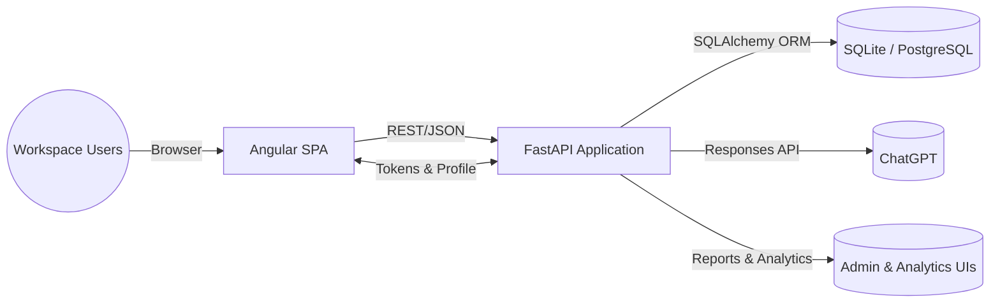
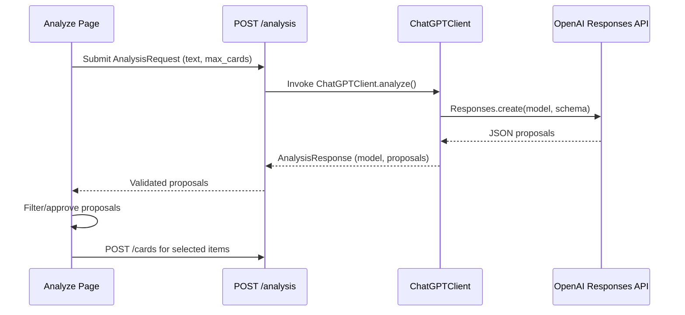
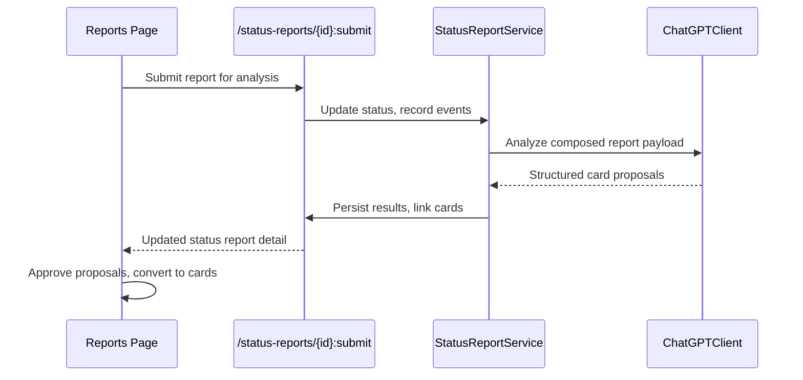

# Architecture Overview

## System Context
Verbalize Yourself pairs an Angular single-page application with a FastAPI backend. The SPA calls JSON APIs for task management, analytics, reporting, competency evaluation, and administration, while the backend orchestrates persistence, AI integrations, and quota enforcement. Secrets such as the OpenAI key are stored encrypted in the database and surfaced only to administrators.

## Frontend Architecture
### Module layout
Routes are declared in `app.routes.ts` and lazy-load standalone components for each feature area:
- **Board** (`features/board`) – Kanban experience with Angular CDK drag-and-drop, quick filters, and a drawer that exposes comments, subtasks, timelines, and template hints from the workspace store.
- **Analyze** (`features/analyze`) – Intake form that submits free-form notes to `/analysis`, presents AI proposals, and lets operators curate which cards to publish.
- **Reports** (`features/reports`) – Shift report editor that drafts sections, triggers AI processing, displays generated cards, and preserves submission history.
- **Analytics** (`features/analytics`) – Dashboards driven by the continuous improvement store showing recurrence trends, root-cause hierarchies, initiatives, and suggested actions.
- **Profile & Settings** (`features/profile`, `features/settings`) – User profile management, quota visibility, and workspace preferences.
- **Admin console** (`features/admin`) – Restricted by `adminGuard`, allowing API credential management, quota defaults, competency CRUD, evaluation jobs, and user role management.
- **Auth** (`features/auth`) – Login/registration flows guarded with email/password validation and localized error messaging.

### State management & data access
- **WorkspaceStore** (`core/state/workspace-store.ts`) caches board metadata, status/label catalogues, templates, and card interactions. It normalizes AI proposals, applies optimistic updates, and persists user board preferences to `localStorage`.
- **ContinuousImprovementStore** coordinates analytics snapshots, root-cause trees, initiatives, and suggested actions. It synthesises report summaries and supports AI-generated report previews.
- **API services** in `core/api` encapsulate HTTP requests, centralize error handling, and reuse the `API_BASE_URL` helper. Credentials are injected via the auth service, which stores the session token in memory and browser storage.
- **Guards** (`core/auth/auth.guard.ts`, `core/auth/admin.guard.ts`) redirect unauthenticated users to the login page and block administrative routes unless the `UserProfile` contains `isAdmin=true`.

### UX considerations
- Tailwind utility classes and SCSS modules power layout and design tokens.
- Shared UI components live under `shared/ui` and provide reusable controls (drawers, forms, empty states).
- Accessibility is reinforced through ARIA labels in admin tables and board actions, matching expectations documented in `docs/known-issues.md`.

## Backend Architecture
### Application startup
`app.main` loads environment settings, configures CORS, runs lightweight migrations (`migrations.py`), and creates tables before mounting routers. Startup migrations ensure legacy tables gain required columns (`users.is_admin`, profile metadata, comment links) and promote the first user to an administrator when necessary.

### Router surface
Routers are organized by domain beneath `app/routers`:
- **Auth & profile** – `/auth`, `/profile`, `/preferences` handle registration, session tokens, profile enrichment, and preference persistence. Session tokens are hashed and rotated on login.
- **Workspace operations** – `/cards`, `/subtasks`, `/comments`, `/activity`, `/labels`, `/statuses`, `/filters`, `/reports` expose CRUD APIs for the kanban board, saved filters, templates, and manual activity entries.
- **Analysis & automation** – `/analysis`, `/status-reports`, `/reports`, `/appeals` orchestrate AI analysis of free-form notes, status report submissions, generated reports, and appeal narratives.
- **Analytics & improvement** – `/analytics`, `/initiatives`, `/suggested-actions` manage recurrence snapshots, root-cause trees, improvement initiatives, and proposal-to-card conversions.
- **Competency management** – `/competencies`, `/competency-evaluations`, `/evaluation-jobs` allow administrators to define competency rubrics, trigger evaluations, and review histories, enforcing daily quotas.
- **Administration** – `/admin/users`, `/admin/quotas`, `/admin/api-credentials`, `/admin/settings`, `/admin/error-categories` expose privileged operations guarded by `require_admin`.

### Services & business logic
- **ChatGPT integration** (`services/chatgpt.py`) validates Responses API payloads against strict JSON schemas, enforces configuration checks, and provides fallbacks when responses are empty or invalid. It also generates Japanese-language appeals using templated prompts in `app/prompts`.
- **StatusReportService** (`services/status_reports.py`) composes submissions, records lifecycle events, enforces quotas, and links generated cards back to the originating report.
- **AppealsService** (`services/appeals.py`) persists appeal requests, renders Markdown/CSV variants, and applies connective phrasing rules defined in `services/appeal_prompts.py`.
- **CompetencyEvaluator** (`services/competency_evaluator.py`) aggregates completion metrics, applies rubric thresholds, and produces evaluative summaries delivered to profiles and admin history views.
- **Profile service** (`services/profile.py`) normalizes avatars, biographies, and role metadata, handling optional Pillow support with descriptive validation errors.

### Persistence model
`models.py` defines the relational schema using SQLAlchemy declarative mappings:
- **Core workspace** – `User`, `SessionToken`, `Card`, `Subtask`, `Label`, `Status`, `UserPreference`, `Comment`, `ActivityLog`, and `SavedFilter` support day-to-day task operations.
- **Analytics & improvement** – `AnalyticsSnapshot`, `RootCauseAnalysis`, `RootCauseNode`, `SuggestedAction`, `ImprovementInitiative`, and `InitiativeProgressLog` capture recurrence trends and remediation progress.
- **Reporting & AI** – `StatusReport`, `StatusReportCardLink`, `StatusReportEvent`, `ReportTemplate`, `GeneratedReport`, and `AppealGeneration` preserve submissions, generated outputs, and linkage between AI artefacts and human decisions.
- **Governance & quotas** – `QuotaDefaults`, `UserQuotaOverride`, `DailyCardQuota`, `DailyEvaluationQuota`, and `ApiCredential` enforce rate limits and encrypted secret storage.
- **Competency evaluation** – `Competency`, `CompetencyCriterion`, `CompetencyEvaluation`, `CompetencyEvaluationItem`, and `CompetencyEvaluationJob` back the evaluation workflows and historical audit trail.

All models inherit timestamp mixins for auditing. Secrets are encrypted via `utils/secrets.py`, which derives a cipher from `SECRET_ENCRYPTION_KEY` and stores only hints alongside encrypted payloads.

## AI & Automation Workflows
### Free-form analysis intake

### Status report processing

### Appeals & competency evaluation
- **Appeals** – Administrators trigger `/appeals` endpoints with subject metadata and highlighted achievements. The service renders Markdown, bullet list, and CSV outputs in Japanese, ensuring connective phrases and causal links align with cultural norms.
- **Competency evaluations** – `/evaluation-jobs` enqueue manual assessments while scheduled jobs leverage aggregated completion metrics. Results feed both admin dashboards and profile timelines, with quota enforcement preventing overuse.

## Security & Access Control
- Session tokens are hashed and rotated; the auth router removes existing tokens on login to prevent parallel sessions.
- `require_admin` protects administrative routers. Frontend guards mirror this constraint, hiding privileged navigation for non-admins.
- OpenAI credentials and other API secrets are encrypted at rest. Only a masked hint is returned to the UI.
- Daily quotas (`DailyCardQuota`, `DailyEvaluationQuota`) ensure AI-powered actions respect workspace limits. Violations surface descriptive HTTP 429 errors.
- Input validation is pervasive: Pydantic schemas enforce payload shapes, JSON schema validation protects AI responses, and services raise `HTTPException` for inconsistent state transitions.

## Observability & Error Handling
- Exceptions during AI calls are caught, logged, and converted into user-facing error messages so failed analyses do not block other operations.
- Status report events record every state change (`DRAFT_CREATED`, `SUBMITTED`, `ANALYSIS_STARTED`, `ANALYSIS_FAILED`, `COMPLETED`) to support auditing.
- The frontend logger service funnels console output for development diagnostics, and store effects gracefully handle network errors by emitting localized notifications.

## Additional Resources
- `docs/features/` – Detailed feature requirements and design diagrams.
- `docs/persistence-detail-design.md` – Deep dive into database tables, indexes, and migration strategy.
- `docs/known-issues.md` – UI/UX issues to monitor when validating releases.
