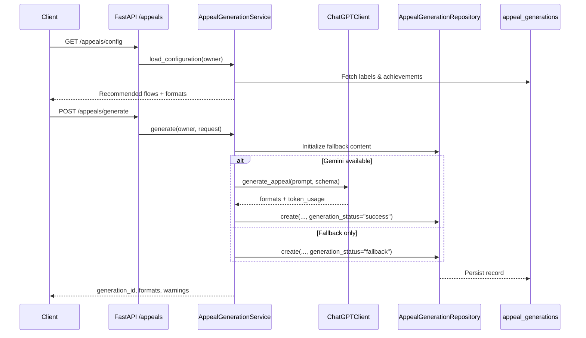

# Appeal Narrative Generation Detailed Design

## 1. Purpose
The `/appeals` API lets users select an appeal subject from card labels or custom text and generate achievement stories that follow a recommended flow. Even if Gemini generation fails, the API returns fallback text so reporting work is never blocked.【F:backend/app/routers/appeals.py†L1-L27】【F:backend/app/services/appeals.py†L1-L200】

## 2. Component Structure

## 3. API Layer
`backend/app/routers/appeals.py` exposes the FastAPI router and only allows authenticated users.【F:backend/app/routers/appeals.py†L1-L27】
- `GET /appeals/config` – Returns owned labels, the recommended flow, and available format definitions.【F:backend/app/services/appeals.py†L70-L115】
- `POST /appeals/generate` – Receives requests, sanitizes inputs, and calls `AppealGenerationService.generate`.【F:backend/app/services/appeals.py†L78-L163】

Requests use the `AppealGenerationRequest` schema, which validates unique flow/format values and enforces the 1–5 step limits.【F:backend/app/schemas.py†L1015-L1059】

## 4. Service Layer
### 4.1 Initialization
`AppealGenerationService` wires together format definitions, the Gemini client, the fallback builder, and the repository. If loading Jinja templates fails, it logs a warning and continues with fallback-only behavior.【F:backend/app/services/appeals.py†L32-L67】

### 4.2 Loading configuration
The service fetches labels owned by the user and attaches up to five recent achievements. Achievements are HTML-escaped so the UI can preview them directly.【F:backend/app/services/appeals.py†L219-L270】

### 4.3 Generation flow
1. **Resolve subject** – For `label` subjects, verify ownership and use the label name; for `custom`, escape HTML and enforce the 120-character limit.【F:backend/app/services/appeals.py†L84-L175】
2. **Collect and sanitize achievements** – Combine label-linked achievements or explicit `achievements`, mask emails/phones/numbers, and de-duplicate entries.【F:backend/app/services/appeals.py†L202-L217】【F:backend/app/services/appeals.py†L169-L199】
3. **Prepare fallback content** – Initialize all formats with fallback text to guarantee a baseline response.【F:backend/app/services/appeals.py†L106-L116】【F:backend/app/services/appeals.py†L293-L310】
4. **Call Gemini** – Build prompts and JSON schemas from templates, validate the returned `formats` and `token_usage`, and merge them into the response.【F:backend/app/services/appeal_prompts.py†L21-L156】【F:backend/app/services/appeals.py†L117-L138】
5. **Evaluate warnings** – Detect structures that weaken causality (e.g., missing problem steps) and return warning messages.【F:backend/app/services/appeals.py†L272-L279】
6. **Persist history** – Store generation ID, subject, flow, formats, warnings, token usage, and status via `AppealGenerationRepository.create`.【F:backend/app/repositories/appeals.py†L17-L41】

## 5. Prompt & Fallback Design
- **Templates** – `appeals.jinja` assembles subject details, flow steps, achievements, requested formats, and causal connectors into the prompt.【F:backend/app/services/appeal_prompts.py†L21-L96】
- **Response schema** – Requires each format entry to provide `{content, tokens_used}` and rejects unspecified keys.【F:backend/app/services/appeal_prompts.py†L120-L156】
- **Fallbacks** – Provide unified Markdown, bullet list, and CSV templates that include causal connectors even when no achievements are present.【F:backend/app/services/appeal_prompts.py†L96-L173】

## 6. Data Model
The `appeal_generations` table stores subject, flow, formats, content, token usage, warnings, and status in JSON columns tied to the user.【F:backend/app/models.py†L708-L723】

## 7. Error Handling
- Return 404 when labels are missing, and switch to fallback responses for runtime exceptions.【F:backend/app/services/appeals.py†L84-L162】
- Log warnings when Gemini fails and respond with fallback content marked `generation_status='fallback'`.【F:backend/app/services/appeals.py†L117-L145】
- Skip Gemini calls if templates cannot be loaded and rely on logged warnings only.【F:backend/app/services/appeals.py†L54-L144】

## 8. Telemetry & Monitoring
Because the service stores token usage and status, the history records enable dashboards that track fallback rate and average token consumption.【F:backend/app/repositories/appeals.py†L17-L41】 Generation time is captured in application logs to monitor the 8-second p95 SLA.【F:backend/app/services/appeals.py†L117-L145】

## 9. Test Approach
- **Unit tests** – Cover flow/format validation, sanitization, and fallback template output.
- **Service integration tests** – Use a mocked Gemini client to exercise success, failure, and fallback paths, verifying warnings and history persistence.
- **Regression tests** – Validate `list_recent` ordering and limit rules when retrieving histories.【F:backend/app/repositories/appeals.py†L17-L50】
