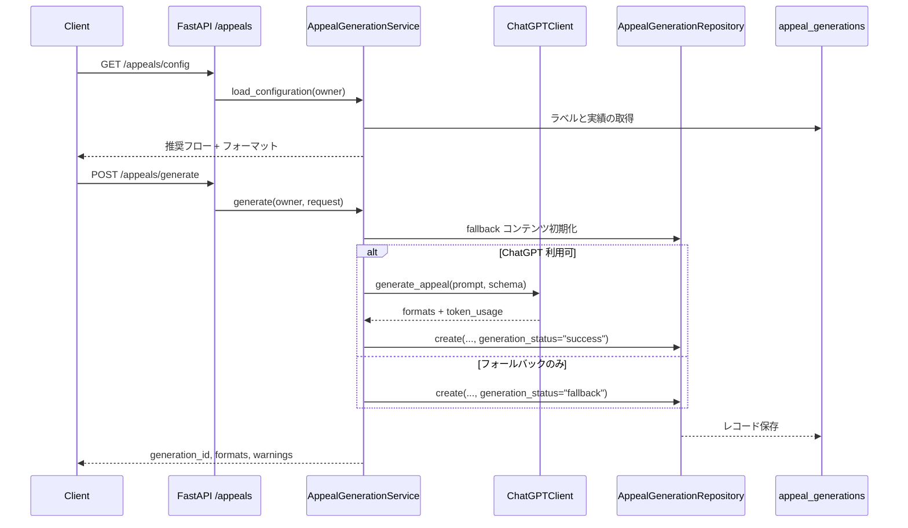

# Appeal Narrative Generation 詳細設計

## 1. 目的
`/appeals` API はカードのラベルや自由入力からアピール対象を選び、推奨フローに沿って成果ストーリーを生成するバックエンド機能です。ChatGPT を利用した生成に失敗した場合でもフォールバック文章を返すことで、成果報告を止めない設計としています。【F:backend/app/routers/appeals.py†L1-L27】【F:backend/app/services/appeals.py†L1-L200】

## 2. コンポーネント構成

## 3. API 層
`backend/app/routers/appeals.py` が FastAPI ルーターを提供し、認証済みユーザーのみが利用できます。【F:backend/app/routers/appeals.py†L1-L27】
- `GET /appeals/config` – 所有ラベルと推奨フロー、利用可能なフォーマット定義を返却。【F:backend/app/services/appeals.py†L70-L115】
- `POST /appeals/generate` – 生成要求を受け取り、サニタイズ後に `AppealGenerationService.generate` を呼び出します。【F:backend/app/services/appeals.py†L78-L163】

入力スキーマは `AppealGenerationRequest` で、flow/format の一意性と 1～5 ステップ制限をバリデーションします。【F:backend/app/schemas.py†L1015-L1059】

## 4. サービス層
### 4.1 初期化
`AppealGenerationService` はフォーマット定義、ChatGPT クライアント、フォールバックビルダー、リポジトリを束ねます。Jinja テンプレート読み込みに失敗した場合はフォールバックのみで動作し、警告ログを残します。【F:backend/app/services/appeals.py†L32-L67】

### 4.2 Config 読み込み
ユーザー所有ラベルを取得し、直近のカード実績を 5 件まで添えて返します。実績は HTML エスケープ済みで UI プレビューにそのまま利用できます。【F:backend/app/services/appeals.py†L219-L270】

### 4.3 生成処理
1. **Subject 解決** – `label` 指定時は所有権チェックを行い、ラベル名を subject として利用。`custom` の場合は HTML エスケープと 120 文字制限を適用します。【F:backend/app/services/appeals.py†L84-L175】
2. **実績収集とサニタイズ** – ラベル紐付けや明示的な `achievements` から実績を集約し、メール・電話・数値をマスクして二重登録を避けます。【F:backend/app/services/appeals.py†L202-L217】【F:backend/app/services/appeals.py†L169-L199】
3. **フォールバック生成** – 事前に全フォーマットをフォールバックコンテンツで初期化し、最低限の応答を保証します。【F:backend/app/services/appeals.py†L106-L116】【F:backend/app/services/appeals.py†L293-L310】
4. **ChatGPT 呼び出し** – テンプレートからプロンプトと JSON スキーマを生成し、レスポンスの `formats` と `token_usage` を検証後に統合します。【F:backend/app/services/appeal_prompts.py†L21-L156】【F:backend/app/services/appeals.py†L117-L138】
5. **警告判定** – 課題ステップが欠けるなど因果関係が弱まる構成を検出し、警告メッセージを返却します。【F:backend/app/services/appeals.py†L272-L279】
6. **履歴保存** – 生成 ID、subject、flow、formats、warnings、トークン使用量、ステータスを `AppealGenerationRepository.create` で永続化します。【F:backend/app/repositories/appeals.py†L17-L41】

## 5. プロンプト & フォールバック設計
- **テンプレート** – `appeals.jinja` で subject、フローステップ、実績、要求フォーマット、因果接続詞を指示として組み立てます。【F:backend/app/services/appeal_prompts.py†L21-L96】
- **レスポンススキーマ** – `formats` オブジェクトにフォーマット ID ごとの `{content, tokens_used}` を要求し、未指定キーを拒否します。【F:backend/app/services/appeal_prompts.py†L120-L156】
- **フォールバック** – Markdown/箇条書き/CSV で統一された構造を持つテンプレートを用意し、実績がない場合も因果接続詞を含む定型文を返します。【F:backend/app/services/appeal_prompts.py†L96-L173】

## 6. データモデル
`appeal_generations` テーブルは subject/flow/formats/コンテンツ/トークン使用量/警告/ステータスを JSON カラムで保持し、ユーザーと関連付けます。【F:backend/app/models.py†L708-L723】

## 7. エラーハンドリング
- ラベル未存在時は 404、処理中の例外はフォールバック応答に切り替えます。【F:backend/app/services/appeals.py†L84-L162】
- ChatGPT 失敗は警告ログを残し、フォールバックの `generation_status='fallback'` で応答します。【F:backend/app/services/appeals.py†L117-L145】
- テンプレート読み込み失敗時は ChatGPT 呼び出しをスキップし、ログのみを出力します。【F:backend/app/services/appeals.py†L54-L144】

## 8. テレメトリ・監視
生成処理ではトークン使用量とステータスを保存しているため、履歴レコードを基にフォールバック率や平均トークンをダッシュボード化できます。【F:backend/app/repositories/appeals.py†L17-L41】生成時間はアプリケーションログで計測し、p95 8 秒 SLA 監視に利用します。【F:backend/app/services/appeals.py†L117-L145】

## 9. テスト方針
- **単体テスト** – flow/format バリデーション、サニタイズ、フォールバックテンプレート出力を検証。
- **サービス統合テスト** – ChatGPT モックを用いて成功/失敗/フォールバック経路を網羅し、警告生成と履歴保存を確認。
- **回帰テスト** – `list_recent` を利用した履歴取得で最新順・件数制限が守られるかを検証。【F:backend/app/repositories/appeals.py†L17-L50】
