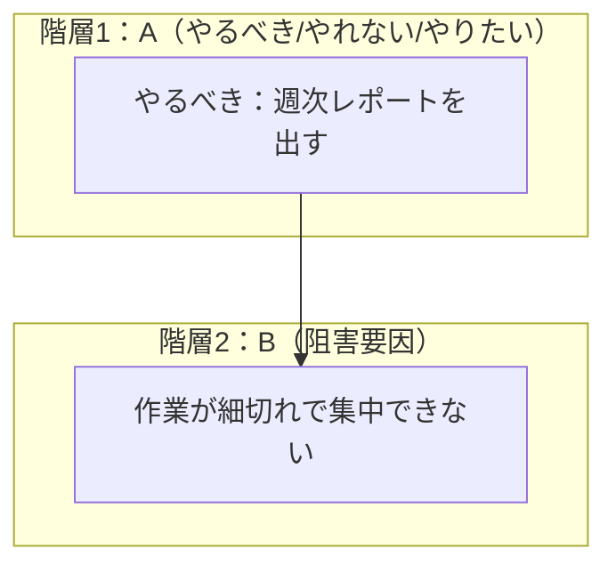

# 免疫マップ（AI 推測 + Mermaid 可視化）設計詳細

## 1. 方針

- AI には Mermaid を直接生成させず、**構造化データ（ノード/参照関係）を生成**させる。
- Mermaid 文字列はサーバ側で組み立てる（スキーマ検証・非表示ルール・エスケープを確実にする）。
- Mermaid Live Editor に貼り付けて描画できる **単一の Mermaid ドキュメント**（テキスト）を API で返す。

## 2. データモデル（論理）

### 2.1 ImmunityMapPayload（AI 生成・保存対象）

- `nodes[]`
  - `id`: `A1` など（カテゴリ文字 + 連番）
  - `group`: `A|B|C|D|E|F`
  - `label`: 表示文（必須、空は禁止）
  - `kind`（任意）: A の場合のみ `should|cannot|want`
- `edges[]`
  - `from`: ノード ID
  - `to`: ノード ID

制約:

- `group` ごとの意味は `docs/features/immunity-map/requirements.md` の定義に従う。
- 許可する接続は A→B, A→C, B→D, B→E, C→E, C→F のみ。
- ラベルは 1 ノードあたり上限文字数を設ける（例: 200 文字）。

### 2.2 ImmunityMapAnalysis（永続化する場合）

- `id`
- `owner_user_id`
- `target_type`（任意）: `snapshot|card|none`
- `target_id`（任意）
- `version`（再生成の履歴）
- `status`: `in-progress|ready|failed`
- `input`: ユーザー入力（A と背景文）
- `payload`: `ImmunityMapPayload`（検証済み JSON）
- `mermaid`: 生成 Mermaid（サーバで生成した文字列）
- `model`: 使用モデル名（例: Gemini の `response.model`）
- `created_at` / `updated_at`

## 3. API 設計（案）

### 3.1 生成

- `POST /analysis/immunity-map`
  - Request（例）:
    - `a_items[]`: `{ kind: "should"|"cannot"|"want", text: string }`
    - `context`（任意）: string
    - `target`（任意）: `{ type: "snapshot"|"card", id: string }`
  - Response:
    - `analysis_id`（保存する場合）
    - `payload`: `ImmunityMapPayload`
    - `mermaid`: string
    - `summary`（任意）: string

### 3.2 取得（保存する場合）

- `GET /analysis/immunity-map/{analysis_id}`
  - Response: 上記と同等（`payload` と `mermaid` を返す）

エラー方針:

- Gemini 未設定: `503 Service Unavailable`
- Gemini 呼び出し失敗: `502 Bad Gateway`
- スキーマ不正（AI 応答が要件を満たさない）: `502` で再実行可能なエラーとして返し、DB へ保存しない
- 入力不正（A が 0 件等）: `422 Unprocessable Entity`

## 4. AI 生成（プロンプト/スキーマ）

### 4.1 生成の考え方

- 入力は「A と背景」を最優先とする。
- B〜F は **断定ではなく仮説**として生成し、過度に医療/診断的な表現は避ける。
- 生成結果は `ImmunityMapPayload` のみを返す（余計なテキストを混ぜない）。

### 4.2 スキーマ検証

- Gemini の構造化出力（JSON schema）で `nodes/edges` を受け取る。
- サーバ側で追加検証する:
  - `label` の空白除去後が空でない
  - `group` と `id` の整合（`A` グループは `A1..`）
  - 参照先が存在する `edge` のみ採用
  - 許可されない接続は破棄（または全体を失敗として再試行）

## 5. Mermaid 生成

### 5.1 生成ルール

- `flowchart TD` を基本とする（必要なら UI で LR へ切り替え）。
- A〜F は `subgraph` で囲み、**該当カテゴリにノードが 1 件以上ある場合のみ**出力する。
- ノードのラベルは Mermaid 文字列として安全に出力する（`"` のエスケープ、改行の ` ` 置換等）。
- **空ノード/空エッジ/空カテゴリは出力しない**（要件）。

### 5.2 Mermaid 例（最小）

## 6. フロントエンド設計（案）

- 既存の「なぜなぜ分析」UI を置換し、免疫マップ生成 UI を提供する。
- 画面要素（例）:
  - A 入力フォーム（やるべき/やれない/やりたい）
  - 背景（任意）
  - 生成ボタン、再生成ボタン
  - Mermaid 出力（コード表示 + コピーボタン）
  - Mermaid Live Editor を開くリンク

状態管理:

- 生成リクエスト中はローディングを表示し、成功時に `payload` と `mermaid` を表示する。
- 保存する場合は `analysis_id/version` を保持し、履歴を選べるようにする（後続）。

## 7. 置換・削除の方針（参照）

- 既存の「なぜなぜ分析（Why-Why）」は機能/データモデル/API/UI を廃止し、免疫マップへ一本化する。
- 具体的な削除対象（ルータ、モデル、フロントの状態管理、関連 UI）は実装時の差分で確定する。

